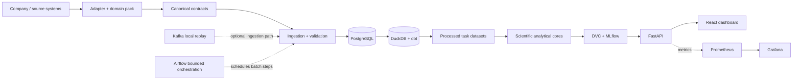

# FMCG Sales Intelligence

FMCG Sales Intelligence is a reproducible local AI/ML platform for retail and distribution analytics. It combines an operational database, analytical warehouse, seven frozen analytical cores, governed artifacts, APIs, a business dashboard, and engineering observability behind a generic core with replaceable company/domain configuration.

The Coca-Cola configuration is synthetic and demonstration-only: it is not an official Coca-Cola product and uses no internal Coca-Cola data. The project was developed in an academic/practice context. Its analytical core is company-independent for compatible FMCG, retail, and distribution use cases.

## What the project does

- normalizes company data through versioned contracts and domain packs;
- maintains PostgreSQL operational facts and DuckDB/dbt analytical models;
- builds point-in-time-aware task datasets with Great Expectations checks;
- serves frozen forecasting and stockout models through FastAPI;
- exposes exploratory cluster membership and offline analytical outputs;
- tracks data/model identity with DVC and canonical run metadata with MLflow;
- provides a React dashboard and Prometheus/Grafana engineering telemetry.

## Architecture



Supporting components are not part of every synchronous API request. See the [architecture description](docs/architecture/portfolio_architecture_v1_3.md).

## Analytical capabilities

| Capability | Method | Output | Status |
|---|---|---|---|
| Demand forecasting | CatBoost regression | units over `(t,t+7d]` | Frozen V1 serving |
| Stockout classification | HistGradientBoosting | seven-day risk score | Frozen V1 serving; not claimed strongly calibrated |
| Stockout survival | Cox PH | time-to-event analysis | Offline experimental |
| Store segmentation | KMeans, `k=3` | exploratory clusters | Offline review |
| Cluster membership | frozen KMeans `predict` | cluster assignment and centroid distance | Experimental serving |
| Anomaly detection | Isolation Forest | candidate anomalies | Offline review |
| Basket analysis | FP-Growth | association rules | Offline analytics |
| Promotion analysis | descriptive before/during/after windows | observed change | Offline analytics; not causal uplift |

Cluster membership is not a validated business-segment classifier. Supervised segment classification remains `DEFERRED_NOT_JUSTIFIED_V1` because no governed ground-truth taxonomy exists.

## Key scientific results

These are persisted frozen evaluation values, not general production guarantees.

| Evidence | Frozen result |
|---|---:|
| Forecast test WAPE | 0.3778884755 |
| Stockout test average precision | 0.2551216857 |
| Survival test C-index | 0.7922890233 |
| Segmentation | k=3; silhouette 0.3307169762 |
| Isolation Forest candidate rate | 0.0241503797 |
| Canonical basket rules | 1,262 |
| Promotion descriptive units change | 0.0621638304 |

## Technology stack

| Layer | Active technology |
|---|---|
| Data platform | PostgreSQL, DuckDB, dbt, optional local Kafka replay |
| ML and analytics | Python, scikit-learn, CatBoost, lifelines, mlxtend |
| MLOps | DVC, MLflow |
| Serving | FastAPI, Pydantic, Uvicorn |
| Frontend | React, TypeScript, Vite, ECharts |
| Platform | Docker Compose, bounded local Airflow demo |
| Observability | Prometheus, Grafana |
| Quality | pytest, Ruff, Great Expectations |

Airbyte and BigQuery assets are templates only; no executed cloud deployment is claimed.

## Repository structure

```text
apps/       dashboard
artifacts/  canonical outputs, reports, project evidence
config/     contracts, domain packs, modeling configuration
data/       external, generated, processed and warehouse ownership
docs/       current guidance, references and historical evidence
platform/   PostgreSQL, dbt, Airflow, Docker and observability assets
src/        single fmcg_sales_intelligence Python package
tests/      unit, integration, scientific and runtime validation
tools/      developer and demo utilities
```

## Quick start

Prerequisites: Git, Python 3.11+, Node.js/npm, Docker Desktop, and authorized access to the configured private DVC Google Drive remote.

```powershell
git clone https://github.com/Eclipse-XS/FMCG-Sales-Intelligence.git
cd FMCG-Sales-Intelligence
python -m venv .venv
.venv\Scripts\python -m pip install -r requirements.txt
.venv\Scripts\python -m pip install -e . --no-deps
```

Configure Google OAuth only in ignored `.dvc/config.local`, then restore every DVC-owned target:

```powershell
.venv\Scripts\dvc pull
git ls-files *.dvc | ForEach-Object { .venv\Scripts\dvc pull $_ }
Copy-Item .env.example .env
.venv\Scripts\python tools/demo_check.py
```

Start the local product stack:

```powershell
docker compose --profile core --profile mlops --profile observability up -d --build
```

API/OpenAPI: `http://localhost:8000/docs`; dashboard: `http://localhost:8080`; MLflow: `http://localhost:5000`; Prometheus: `http://localhost:9090`; Grafana: `http://localhost:3001`.

Kafka is optional: `docker compose --profile streaming up -d`. Working request bodies are in [API examples](docs/deployment/api_examples_v1_3.md).

## Validation

- pytest: 130 passed in the configured runtime;
- dbt: 55/55 passed;
- Great Expectations: 8/8 datasets passed;
- frontend: 7/7 tests, production build passed, npm audit 0;
- GitHub clean clone plus DVC restoration: passed;
- frozen forecast and stockout serving parity: exact.

Three operational tests may skip in a clean clone when local `.env` is intentionally absent.

## Limitations

- Inputs are synthetic and public donor data, not production company data.
- The historical horizon and number of stores are limited.
- Cluster temporal stability is limited and no governed business-segment taxonomy exists.
- Kafka is a local replay simulation; Airflow is a bounded local orchestration demo.
- Production authentication, TLS, distributed rate limiting and managed secrets are out of scope.
- Airbyte and BigQuery remain templates only.
- Repository licensing requires an explicit owner decision; external-source rights remain source-specific.

## Documentation

- [Current status](docs/project/current_status.md)
- [Architecture](docs/architecture/portfolio_architecture_v1_3.md)
- [Repository structure](docs/architecture/repository_structure_v1_3.md)
- [Dataset contracts](docs/data/dataset_contracts.md)
- [Modeling checkpoint](docs/project/modeling_checkpoint_v1.md)
- [Runtime validation](docs/project/runtime_platform_validation_v1_2.md)
- [Clean-clone proof](docs/project/clean_clone_reproduction_v1.md)
- [Release notes](docs/project/release_v1_3.md)
- [Data-source attribution](docs/data_sources.md)
- [License and attribution audit](docs/project/license_and_attribution_audit_v1_3.md)
