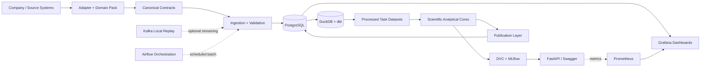

# FMCG Sales Intelligence

FMCG Sales Intelligence is a reproducible local AI/ML platform for retail and distribution analytics. It combines an operational database, an analytical warehouse, seven frozen analytical cores, governed artifacts, REST APIs, and native Grafana dashboards behind a company-independent core with replaceable domain configuration.

The Coca-Cola configuration is synthetic and demonstration-only: it is not an official Coca-Cola product and uses no internal Coca-Cola data. The project was developed in an academic/practice engineering context. Its analytical core is domain-independent for compatible FMCG, retail, and distribution use cases.

---

## What the Project Does

- **Contracts & Domain Adaptation:** Normalizes multi-source FMCG transactional facts through versioned schemas and domain packs.
- **Data Engineering:** Maintains PostgreSQL operational tables and DuckDB/dbt analytical marts with automated data quality checks.
- **Scientific Modeling:** Trains, evaluates, and freezes 7 specialized ML/analytical cores with point-in-time dataset splits.
- **Model Serving:** Serves frozen forecasting and stockout models through high-throughput FastAPI endpoints with strict Pydantic schemas.
- **Publication Layer:** Automatically extracts frozen DVC artifacts and populates PostgreSQL analytical publication tables for instant BI/dashboard consumption.
- **MLOps & Governance:** Governs datasets, model weights, and metrics with DVC; tracks experiment metadata with MLflow.
- **Observability:** Provides multi-tier native Grafana dashboards (Business, Operations, Scientific Diagnostics) and Prometheus telemetry.

---

## Architecture



---

## User-Facing Surfaces

The platform eliminates fragile custom web frontends in favor of industry-standard, native engineering surfaces:

| Surface | URL / Port | Technology | Primary Role |
|---|---|---|---|
| **API & Documentation** | `http://localhost:8000/docs` | FastAPI / Swagger UI | Interactive REST API testing, model inference, and entity resolution |
| **Analytical Dashboards** | `http://localhost:3001` | Grafana 11 | Business KPIs, platform health, and native scientific ML diagnostics |
| **Metrics Telemetry** | `http://localhost:9090` | Prometheus | Real-time endpoint request rate, latency, and container metrics |
| **Experiment Tracking** | `http://localhost:5000` | MLflow | Run parameters, training metrics, and experiment lineage |

---

## Scientific Analytical Cores

The platform implements seven distinct analytical and machine learning capabilities:

| Core | Method | Target / Output | Serving Status |
|---|---|---|---|
| **Demand Forecasting** | CatBoost Regression | Continuous units over next horizon `(t, t+7d]` | Live FastAPI serving |
| **Stockout Classification** | HistGradientBoosting | 7-day binary stockout risk score | Live FastAPI serving |
| **Stockout Survival** | Cox Proportional Hazards | Baseline hazard and time-to-stockout curve | Analytical publication |
| **Store Segmentation** | KMeans (`k=3`), PCA | Exploratory store behavioral clusters | Experimental serving |
| **Anomaly Detection** | Isolation Forest | Anomaly candidate classification & score | Analytical publication |
| **Market Basket Analysis** | FP-Growth | Association rules (support, confidence, lift) | Analytical publication |
| **Promotion Performance** | Pre/During/Post Window Analysis | Observed unit sales uplift and revenue delta | Analytical publication |

### Key Frozen Evaluation Baseline

These values represent persisted evaluation metrics locked under DVC:

| Metric | Frozen Evaluation Result | Artifact Location |
|---|---:|---|
| **Forecast Test WAPE** | `0.3779` (37.79%) | `artifacts/canonical/demand_v1/metrics.json` |
| **Stockout Test Avg Precision** | `0.2551` | `artifacts/canonical/stockout_v1/metrics.json` |
| **Survival Test C-Index** | `0.7923` | `artifacts/canonical/survival_v1/metrics.json` |
| **Segmentation Silhouette** | `0.3307` (`k=3`) | `artifacts/canonical/segmentation_v1/metrics.json` |
| **Anomaly Candidate Rate** | `0.0242` (2.42%) | `artifacts/canonical/anomaly_v1/metrics.json` |
| **Canonical Basket Rules** | `1,262` rules | `artifacts/canonical/basket_v1/metrics.json` |
| **Promotion Descriptive Lift** | `+6.22%` units change | `artifacts/canonical/promotion_v1/metrics.json` |

---

## Grafana Observability Architecture

Dashboards are managed declaratively using a **dashboard-as-code** workflow (`scripts/build_all_redesigned_dashboards.py`) and provisioned directly into Grafana at boot time:

### 1. Business Dashboards (`platform/.../dashboards/json/business/`)
- **FMCG Executive Overview:** Revenue velocity, sales distribution by channel, inventory value, and order fulfillment status.
- **Sales & Inventory Intelligence:** Real-time stock levels, inventory-to-sales ratios, fast-moving SKUs, and replenishment urgency.

### 2. Operations Dashboards (`platform/.../dashboards/json/operations/`)
- **Platform Health & SLA Telemetry:** API request throughput, P95/P99 response latencies, database connection pool saturation, and system resource consumption.
- **ML Publication Registry:** Automated audit trail of publication runs, row ingestion counts, and artifact synchronization timestamps.

### 3. Scientific Analytics Dashboards (`platform/.../dashboards/json/scientific/`)
- **Demand Forecasting (`ml_forecasting_v1`):** Actual vs. Predicted parity scatter, residual vs. predicted diagnostics, error distribution, and SKU-level forecasts.
- **Stockout Classification (`ml_stockout_classification_v1`):** Precision-Recall curve, ROC curve, decision threshold diagnostics (F1/Precision/Recall vs. cutoff).
- **Stockout Survival (`ml_stockout_survival_v1`):** Kaplan–Meier survival curve, Cox proportional hazard rates, and median survival time.
- **Store Segmentation (`ml_segmentation_v1`):** K-selection optimization curves (Silhouette & Davies-Bouldin), standardized cluster profiles, centroid distance diagnostics, and store assignments.
- **Anomaly Detection (`ml_anomaly_v1`):** Anomaly score distribution and outlier isolation scatter.
- **Market Basket Analysis (`ml_basket_v1`):** Support vs. Confidence vs. Lift scatter and searchable association rule tables.
- **Promotion Performance (`ml_promotion_v1`):** Pre/During/Post promotional uplift scatter and incremental revenue calculations.

---

## Reproducibility & Publication Pipeline

```text
artifacts/canonical/  (DVC Frozen Models & Metrics)
         │
         ▼
src/.../publish_scientific_results.py  (Publication Layer ETL)
         │
         ▼
PostgreSQL ml_results.*  (Live Relational Serving Schema)
         │
         ▼
Grafana Native Dashboards  (Automated Scientific Diagnostics)
```

1. **DVC Pipeline:** Governs reproducible execution (`dvc.yaml`) and cryptographic output hashes (`dvc.lock`). Models and raw data are versioned in DVC cache.
2. **Serving Independence:** Live FastAPI inference loads models directly from `artifacts/canonical/` without runtime dependency on MLflow.
3. **Publication Layer:** A containerized publisher service (`platform/docker/publisher.Dockerfile`) executes `publish_scientific_results.py`, mapping frozen experiment outputs into PostgreSQL tables (`ml_results.forecasting_eval_points`, `ml_results.stockout_pr_curve`, etc.) for seamless dashboard queries.
4. **Verification Suites:** Automated headless tools (`verify_grafana_and_queries.py`, `verify_render.py`) continuously validate that every panel query returns valid data without frontend errors.

---

## Repository Structure

```text
FMCG-Sales-Intelligence/
├── .dvc/                             # DVC metadata & config (cache ignored)
├── .github/                          # CI/CD workflows
├── artifacts/                        # Governed machine learning artifacts
│   ├── canonical/                    # Frozen model checkpoints & metrics (DVC)
│   ├── project/                      # Contract & model serialization catalogs
│   └── reports/                      # EDA & data engineering validation reports
├── data/                             # Analytics lakehouse (ignored / *.dvc tracked)
│   ├── processed/                    # Feature stores & modeling datasets
│   └── warehouse/                    # DuckDB analytics store (fmcg.duckdb)
├── db/                               # PostgreSQL schemas, DDL & migrations
├── docs/                             # Architecture diagrams & technical specifications
├── examples/                         # API usage tutorials & Jupyter walkthrough
├── platform/                         # Docker & observability runtime infrastructure
│   ├── docker/                       # Container Dockerfiles (App, Publisher, DB)
│   └── observability/                # Prometheus & Grafana provisioning
│       └── grafana/provisioning/dashboards/json/  # 11 Redesigned dashboards
├── report/                           # Academic & scientific publication deliverables
│   └── evidence/                     # Publication figures, metric CSVs, manifests
├── scripts/                          # Permanent developer & observability tooling
│   ├── build_all_redesigned_dashboards.py
│   ├── generate_report_evidence.py
│   ├── verify_grafana_and_queries.py
│   └── verify_render.py
├── src/                              # Core Python package
│   └── fmcg_sales_intelligence/     # Pipelines, 7 science cores, serving, reporting
├── tests/                            # Unit, integration, and contract test suites
├── .dvcignore
├── .gitattributes
├── .gitignore
├── docker-compose.yml
├── dvc.lock
├── dvc.yaml
├── LICENSE
├── Makefile
├── pyproject.toml
└── README.md
```

---

## Quick Start

### Prerequisites
- **Git**
- **Python 3.11+**
- **Docker Desktop** (with Compose V2)
- *(Optional)* Access to the configured DVC remote if pulling raw data from Google Drive.

### 1. Local Python Environment Setup

```bash
# Clone the repository
git clone https://github.com/Eclipse-XS/FMCG-Sales-Intelligence.git
cd FMCG-Sales-Intelligence

# Create and activate virtual environment
python -m venv .venv
source .venv/bin/activate       # On Windows: .venv\Scripts\activate

# Install package in editable mode
pip install -e .
```

### 2. Environment Configuration

```bash
# Copy development environment template
cp .env.example .env            # On Windows: Copy-Item .env.example .env
```

### 3. Launch Docker Platform

```bash
# Launch database, serving app, publisher, prometheus, and grafana
docker compose up -d --build
```

### 4. Verify Live Services

- **FastAPI OpenAPI Documentation:** [http://localhost:8000/docs](http://localhost:8000/docs)
- **Grafana Observability Dashboards:** [http://localhost:3001](http://localhost:3001) *(login: `admin` / `change_me`)*
- **Prometheus Metrics Engine:** [http://localhost:9090](http://localhost:9090)
- **MLflow Tracking Server:** [http://localhost:5000](http://localhost:5000)

### 5. Automated Quality Verification

Run the headless verification suite to confirm that all services and dashboard queries are functioning:

```bash
# Run unit test suite
pytest tests/unit

# Verify all 70+ Grafana dashboard queries against live PostgreSQL
python scripts/verify_grafana_and_queries.py
```

---

## Publication Evidence

Authoritative, pre-computed empirical evaluation figures (SVG/PNG), performance tables, and dataset manifests are curated in:
📁 **[`report/evidence/`](report/evidence/)**

Key figures include:
- `report/evidence/forecasting/actual_vs_predicted.svg`
- `report/evidence/stockout/roc_curve.svg`
- `report/evidence/stockout/precision_recall.svg`
- `report/evidence/survival/survival_curve.svg`
- `report/evidence/segmentation/clusters.svg`
- `report/evidence/basket/top_rules.svg`
- `report/evidence/promotion/pre_during_post.svg`

---

## Limitations

- **Synthetic Domain Data:** Demonstrations use synthetic and public donor data (Favorita, Dunnhumby, Instacart, M5) under a synthetic Coca-Cola demonstration configuration.
- **Historical Horizon:** Ingestion profiles are bounded for local demonstration and academic reproducibility.
- **Production Scope:** Enterprise secrets management, Kubernetes deployment, and TLS ingress termination are out of scope for this local reference architecture.

---

## Documentation Links

- [System Architecture](docs/architecture/portfolio_architecture_v1_3.md)
- [Repository Structure Specification](docs/architecture/repository_structure.md)
- [Local Port Reference](docs/architecture/local_ports_v1.md)
- [Dataset Contracts](docs/data/dataset_contracts.md)
- [Evidence Manifest](report/evidence/summary/evidence_manifest.json)
