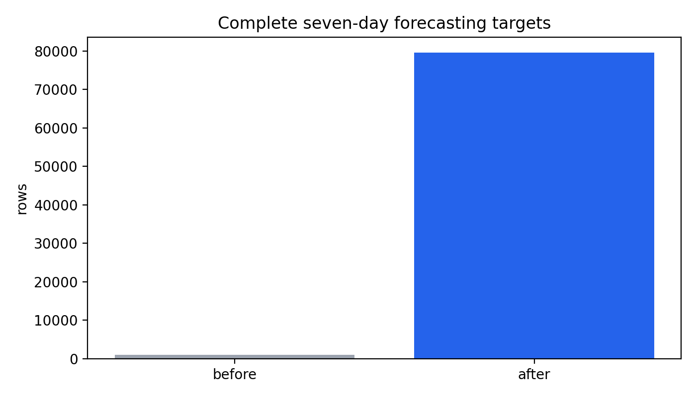
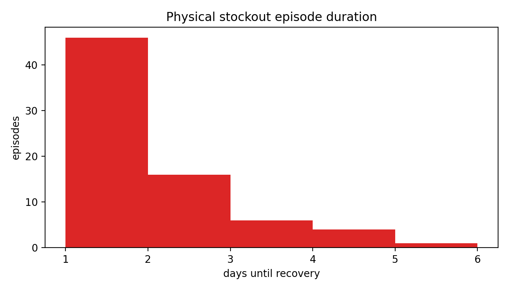

# Targeted data refinement audit

## 1. Original blockers and root causes

The pre-refinement forecasting contract treated the sparse positive-only `sales` table as observation coverage. The generator actually evaluated every store × SKU × day, calculated latent demand, constrained it by inventory, and emitted a sales row only when `sold > 0`. Consequently observed zeros were incorrectly treated as missing and only 1,035 seven-day targets were complete.

Inventory started with 300–900 units per warehouse–SKU and replenished on the same snapshot at roughly three times the reorder point. There was no pending-order state or lead-time exposure. Demand therefore could almost never exhaust inventory; the 14 positive horizons represented only two physical episodes.

## 2. Exact generator and contract changes

The generator now persists a complete `daily_demand` event grid with requested, realized, lost and inventory-censoring fields. Inventory uses heterogeneous reorder/safety/target cover, initial cover, pending replenishment orders, 2–5 day lead times plus occasional 1–3 day delays, and stochastic/promotion-related demand pressure. Stock is never forced to zero and labels are never injected. The forecasting builder reads `fact_daily_demand`; the sparse `fact_sales` remains the realized positive-event ledger.

## 3. Forecasting targeted EDA

- Complete grid: 86,400 date × store × SKU rows.
- Positive realized sales: 35,032; observed zeros: 51,368 (59.45%).
- Complete `(t,t+7]` targets: 79,680 (92.22%); end-censored: 6,720.
- Series: 960; observations per series: 90–90 calendar days.
- Inventory-censored demand rows: 242 (0.280%).
- Requested / realized / lost units: 159,099 / 157,604 / 1,495.
- Null historical lags mean pre-dataset dates. Numeric zero means an observed zero on the complete grid.
- Realized demand is the primary target; requested and lost demand are retained as audit/alternative outcome fields.

- Complete-target distribution: mean 12.81, median 10.00, zero rate 5.99%.

## 4. Stockout targeted EDA

- Positive prediction horizons: 548.
- Independent physical episodes (`>0 → <=0` until recovery): 73 across 44 warehouse–SKU series.
- Right-censored episodes: 1; temporal distribution: early=15, late=36, middle=22.
- Known classification labels: 15,955; positive rate: 3.43%; incomplete no-event censoring: 1,325 (7.67%).
- Episode duration: median 1.0 days, mean 1.60, max 5 days.
- Episodes by warehouse: W1=7, W2=15, W3=23, W4=28.
- Episode-bearing SKUs: 27; top counts: SKU2=12, SKU1=12, SKU6=6, SKU4=5, SKU3=5, SKU15=4, SKU7=4, SKU5=3, SKU13=2, SKU8=2.
- Mean available stock at t, event vs complete non-event: 59.15 vs 85.95; mean distance to reorder point: -24.03 vs 20.18.
- Prediction-horizon positives exceed episode count because several adjacent prediction dates can point to the same future episode. Evaluation must split and score by episode/time, not treat these horizons as independent events.

## 5. Before / after

| Metric | Before | After |
|---|---:|---:|
| Complete forecast targets | 1,035 | 79,680 |
| Positive stockout horizons | 14 | 548 |
| Physical stockout episodes | 2 | 73 |

Forecasting remains 86,400 rows. Its schema grows from the prior sparse-series contract to 24 columns by adding `censored_days_prior_7d`, `target_requested_demand_next_7d`, and `target_lost_sales_next_7d`; lag/rolling/target values now come from the complete grid. Stockout remains 17,280 rows and 18 columns; its contract did not change, but its causal source distribution did.

## 6. Point-in-time and leakage audit

Forecast lags address exact dates t−1/t−7/t−14/t−28, and rolling features use `[t−7,t)`. Same-day realized sales, transaction price and realized promotion are absent. Scheduled price/promotion at t remain an explicit assumption because publication timestamps are not modeled. Targets alone use `(t,t+7]`. Stockout covariates use the snapshot at t or history `<t`; only labels inspect `(t,t+7]`. Pending replenishment outcomes after t are not exposed as features.

## 7. Regression and validation results

PostgreSQL loaded and validated 18 operational tables. PostgreSQL→DuckDB extraction completed for all tables. dbt: 42/42 PASS. Great Expectations: all seven published artifacts PASS. pytest: 29/29 PASS. The episode audit is protected by transition/recovery and minimum-diversity tests.

## 8. Downstream distribution impact

Sales/anomaly row count changed with the causal regeneration (35,032 realized positive rows). Forecasting and stockout changed materially by design. Segmentation, basket and promotion artifacts were regenerated from the same source run and retained their contracts; no Parquet file was patched manually.

## 9. Remaining limitations and readiness

Forecasting: **READY WITH LIMITATIONS** for chronological baseline experiments on realized sales. Requested demand is synthetic latent demand, not externally observed truth; promotions cover broad scheduled periods; only 90 calendar days are available.

Stockout classification: **READY WITH LIMITATIONS**. Seventy-three episodes across 44 warehouse–SKU series and all three temporal blocks permit a small episode-aware temporal evaluation, but event dependence and synthetic calibration prohibit strong generalization claims.

Stockout survival: **READY WITH LIMITATIONS**. Durations and one right-censored terminal episode are represented, but 73 episodes over 90 days are insufficient for complex survival models or stable subgroup inference. Use simple methods and report episode-level uncertainty.

No ML model was trained. This iteration ends at data readiness.

