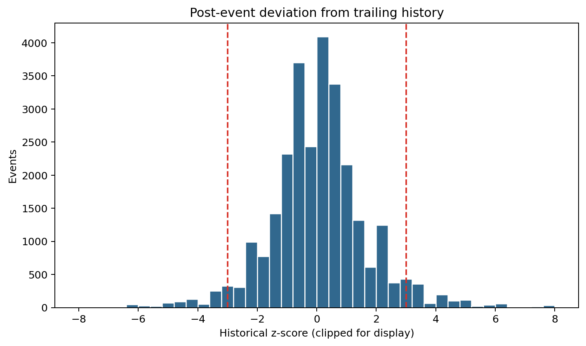
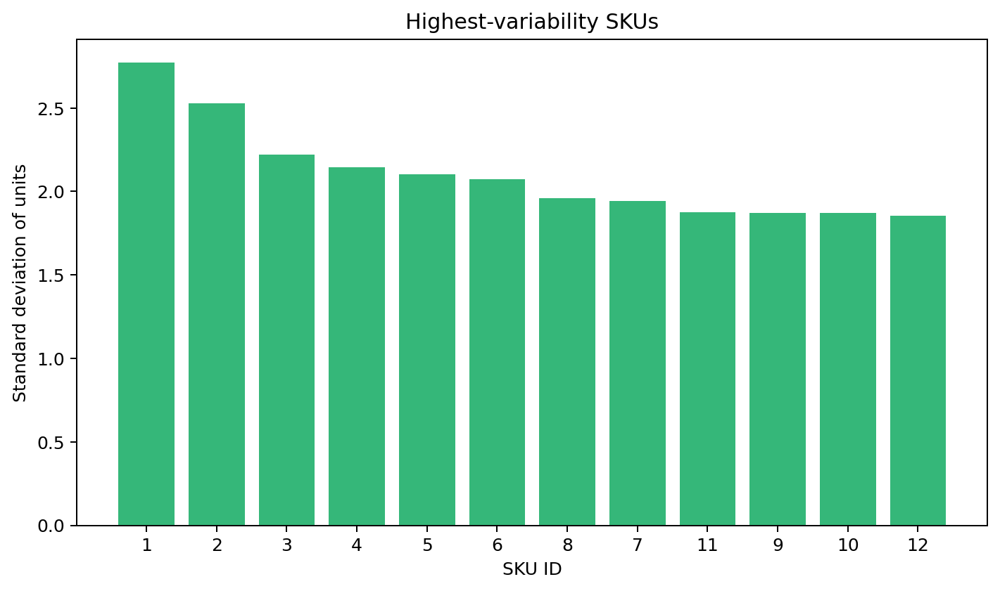

# Anomaly detection EDA

There are 1,910 statistical/contextual candidates with |historical z-score| ≥ 3 among 27,616 rows with a usable rolling standard deviation. These are not verified anomalies.

The contract is post-event: units, realized transaction price and realized promotion state are known when scoring. Missing rolling statistics are structural early/sparse-history cases. No supervised label exists.

Forecast residuals would be useful later, but only if generated from out-of-sample forecasts. In-sample residuals would leak model fit and understate anomaly magnitude.

## Readiness

**READY WITH LIMITATIONS.** Unsupervised/statistical candidate ranking is feasible. Supervised anomaly classification is not. Evaluation will require injected anomalies with a documented mechanism or human-reviewed labels.

