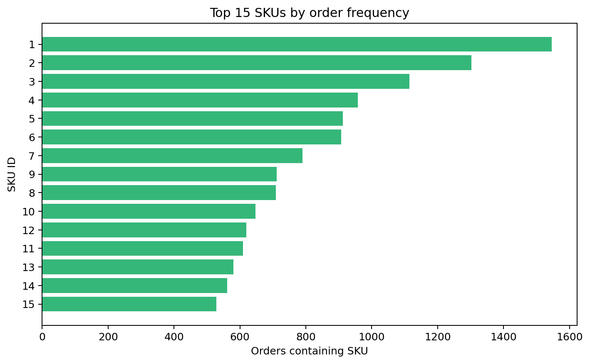

# Market basket EDA

- Orders: 2,000
- SKUs: 48
- Lines: 24,216
- Mean basket size: 12.11; median: 8; range: 5–25
- Duplicate order–SKU keys: 0
- Highest observed pair support: 54.20%

Popularity is intentionally long-tailed because order generation samples SKUs with weights proportional to `1 / sku_id^0.7`. Co-occurrence counts are descriptive and not yet association rules.

## Readiness

**READY.** Two thousand baskets and 48 items are adequate for an instructional association-rule experiment. Future support exploration should start around the empirical pair-frequency range, roughly 0.5%–5%, before confidence/lift filtering; this is a search range, not a tuned choice.

