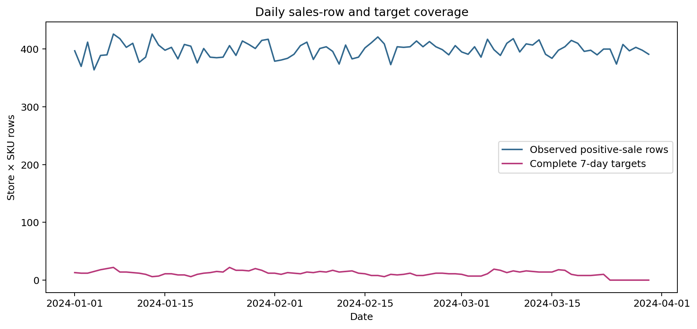
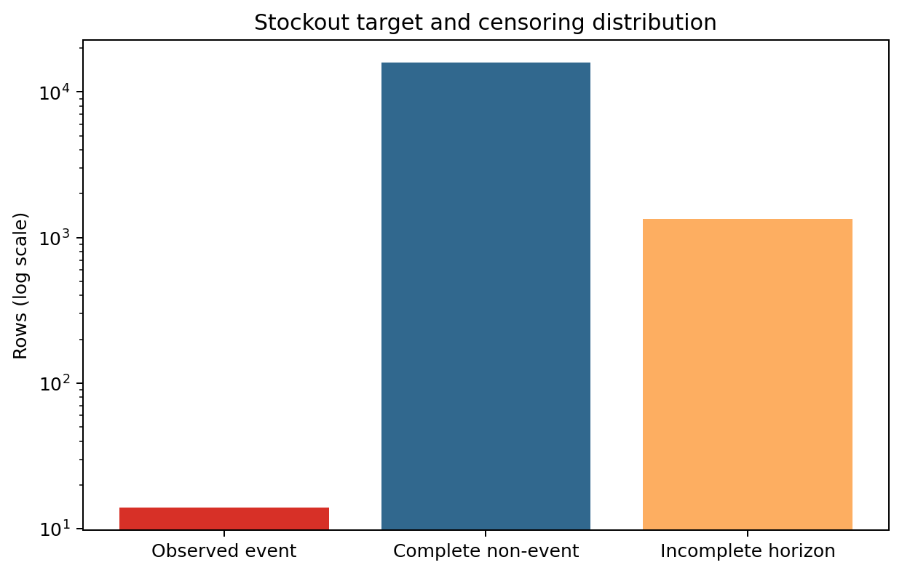
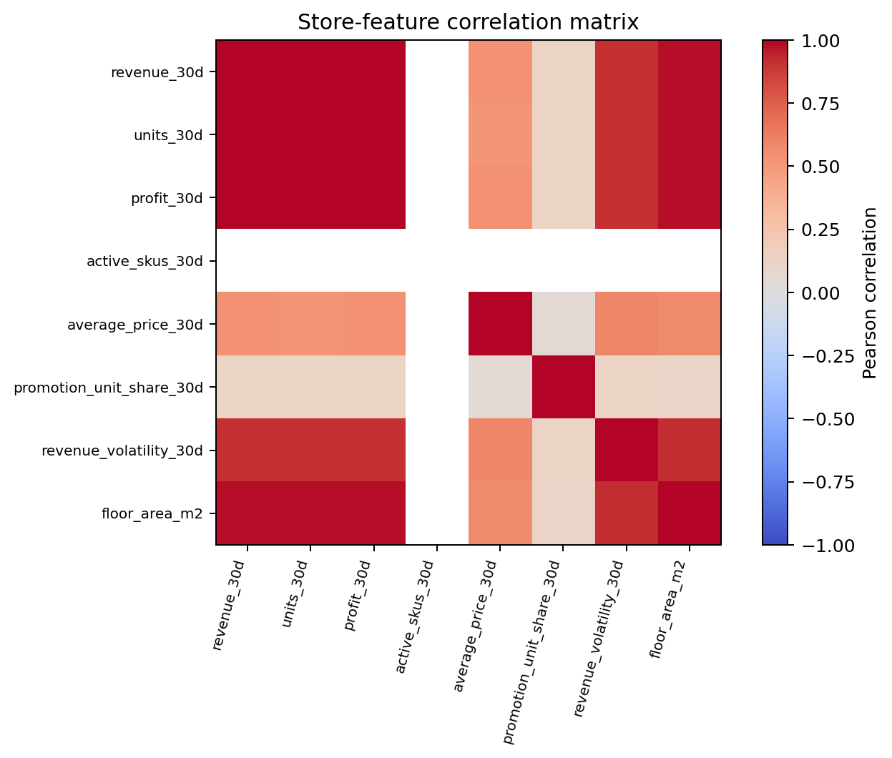
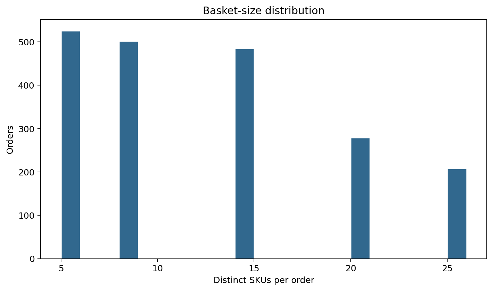

# FMCG Sales Intelligence — EDA Summary

Generated: 2026-09-16T14:03:52.223802+00:00

## 1. Executive technical summary

The datasets are structurally valid, but readiness differs sharply by task. Market basket analysis is usable. Segmentation, anomaly detection and descriptive promotion analysis are usable with explicit limitations. Forecasting and both stockout modeling formulations are not ready with the current synthetic data semantics.

The dominant forecasting issue is now proven from generator code: every store–SKU–day is evaluated, but a sales row is emitted only when `sold > 0`. An absent row therefore represents observed zero sales, potentially combining true zero demand with inventory-censored demand. The frozen DE contract treats those absences as unknown and leaves only 1,035 complete seven-day targets.

The dominant stockout issue is event scarcity: 14 positive prediction rows arise from only a small number of physical zero-stock episodes. They cannot support stable supervised or survival estimation.

## 2. Dataset overview

| Artifact | Rows | Role |
|---|---:|---|
| forecasting | 86,400 | grain: prediction_date × store_id × sku_id |
| stockout | 17,280 | grain: prediction_date × warehouse_id × sku_id |
| segmentation | 60 | grain: snapshot_date × store_id |
| segment_assignment | 60 | grain: snapshot_date × store_id |
| anomaly | 35,892 | grain: event_date × store_id × sku_id |
| basket | 24,216 | grain: order_id × sku_id |
| promotion_performance | 2,880 | grain: promotion_id × store_id × sku_id |

## 3. Feature taxonomy

- Numerical measurements: units, prices, revenue, profit, inventory levels, lags and rolling statistics.
- Categorical attributes: brand, category, store type, channel, promotion type and discount type.
- Binary indicators: scheduled promotion, stockout event, observed event and complete horizon.
- Temporal fields: prediction, event, snapshot, order and promotion dates.
- Entity identifiers: store, SKU, warehouse, promotion, order and region IDs. These must not be treated as continuous quantities.

## 4. General data-quality findings

All artifact business keys are unique. Structural nulls occur in early/sparse demand history, incomplete future targets and promotion boundary windows. EDA did not impute, remove outliers, alter targets or overwrite DE artifacts.

## 5. Forecasting findings

Positive-sale coverage is 35,892/86,400 (41.54%). Fully observed targets under the current contract are 1,035 (1.20%). Of the incomplete rows, 78,645 are inside the observable calendar and 6,720 are in the final seven days.

The incompleteness is overwhelmingly caused by positive-only sales facts, not end-of-dataset truncation. The generator proves absent facts are zero observed sales. A later DE revision must decide whether the modeled quantity is observed sales or latent demand censored by stock availability.

## 6. Stockout findings

Observed event rows: 14; complete non-events: 15,922; incomplete horizons: 1,344. Event rate among evaluable horizons is 0.0879%. Physical episode starts: 2.

## 7. Segmentation findings

There are 20 stores observed at three snapshots, not 60 independent stores. Numerical scales differ substantially and revenue/units/profit are redundant. Distance-based clustering will require scaling and store-level stability checks.

## 8. Anomaly findings

The post-event contract supports contextual candidate ranking. 1,910 observations have |historical z-score| ≥ 3, but none is a verified anomaly. Forecast residuals remain unavailable until out-of-sample forecasting exists.

## 9. Basket findings

The data contains 2,000 orders, 48 SKUs and mean basket size 12.11. The long-format representation is suitable for later association-rule baselines.

## 10. Promotion findings

Baseline history is unavailable for 960 rows and post-period history for 960. Comparisons are descriptive, not causal.

## 11. Modeling-readiness matrix

| Task | Status | Evidence |
|---|---|---|
| Demand Forecasting | **NOT READY** | Positive-only facts conflict with missing-as-unknown target construction; only 1,035 complete targets |
| Stockout Classification | **NOT READY** | 14 dependent positive horizons; extreme imbalance |
| Stockout Survival / Time-to-Event | **NOT READY** | Correct censor fields but too few independent events |
| Store Segmentation | **READY WITH LIMITATIONS** | 20 entities, 3 snapshots; sufficient only for exploratory clustering |
| Segment Assignment | **NOT READY** | No clustering model or derived assignments exists |
| Anomaly Detection | **READY WITH LIMITATIONS** | Unsupervised candidate ranking only; no verified labels |
| Market Basket Analysis | **READY** | 2,000 baskets, 48 SKUs, valid order–SKU grain |
| Promotion Performance Analysis | **READY WITH LIMITATIONS** | Descriptive window comparison; no causal identification |

## 12. Critical data limitations

1. Sales facts are positive-only while the forecasting contract treats missing facts as unknown.
2. Stockouts are generated too rarely and positive prediction rows are temporally dependent.
3. Promotion coverage is effectively universal in scheduled windows, limiting promo/non-promo comparison.
4. Segmentation has only 20 independent stores.
5. No verified anomaly labels or causal promotion controls exist.

## 13. Potential leakage concerns

Current feature windows are temporally correct. Future modeling must preserve start-of-day scoring, fit preprocessing on training periods only, split by time, and avoid using future target observability as a predictor. Store snapshots from the same store must not be treated as independent random samples.

## 14. Recommended preprocessing by task

- Forecasting: resolve zero-sales versus censored-demand semantics first; then use explicit dense calendars and missingness indicators where justified.
- Stockout: no resampling until additional independent events exist.
- Segmentation: robust/standard scaling; inspect redundancy before clustering; encode categorical context separately.
- Anomaly: scale within store–SKU context and preserve promo/price context; do not treat outliers as labels.
- Basket: convert long rows to transactions; filter only through transparent empirical support thresholds.
- Promotion: retain NULL boundary windows and use safe denominators.

## 15. Recommended validation strategy

Use rolling-origin temporal validation for forecasting and anomaly residuals; episode-level temporal splits for stockout after regeneration; store-level stability/bootstrap checks for segmentation; order-level resampling for basket analysis; and time-aware untreated comparisons for any future promotion-effect study.

## 16. Recommended baseline models for the next phase

After data blockers are resolved: naïve/seasonal naïve and Croston/TSB for demand; logistic and survival baselines for stockout; k-means/hierarchical baselines for segmentation; robust z-score/isolation baselines for anomaly; Apriori/FP-Growth comparisons for baskets. No such model was trained in this phase.

## 17. Questions before modeling

1. Is the forecasting objective observed sales or latent demand?
2. Should zero-sales facts be materialized explicitly, with separate stockout censoring?
3. What minimum number of independent stockout episodes should the synthetic generator target?
4. Are promotion schedules assumed known before every prediction timestamp?
5. How will anomaly candidates be evaluated without verified labels?

## Most informative figures

