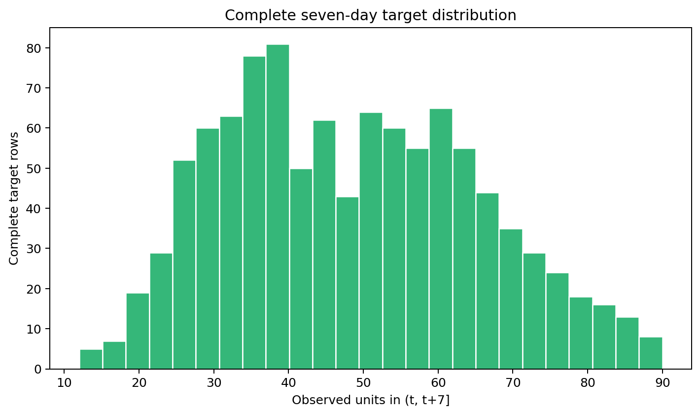
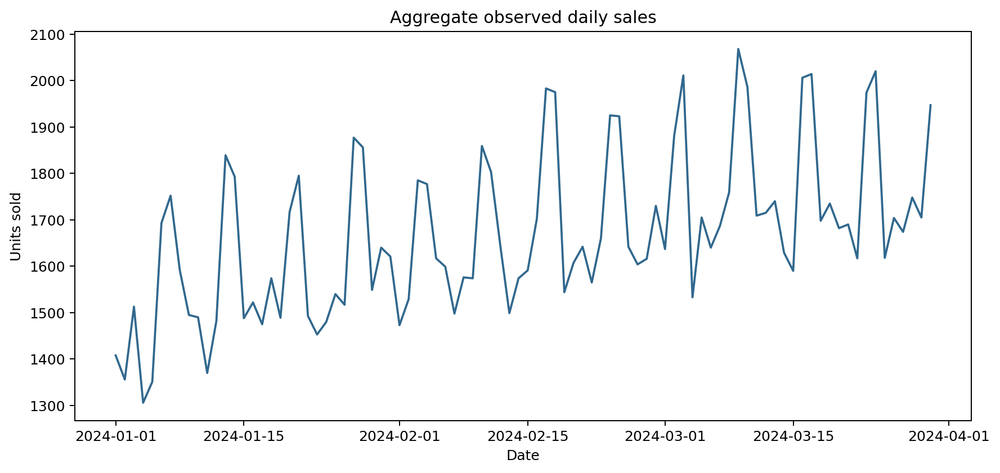

# Forecasting EDA

## Decision gate: meaning of an absent sales row

**FACT:** `generate_dev_data.py` calculates `sold = min(latent, warehouse_stock)` and appends a sales record only inside `if sold:`. The generator evaluates every store × SKU × day. Therefore an absent row means observed sales were zero. It does not always mean latent demand was zero because stock constraints can censor demand.

**CONCLUSION:** the frozen DE assumption ‘missing sales fact = unknown sales’ is wrong for this synthetic generator. For sales forecasting, absent rows should contribute zero. For latent-demand forecasting, stockout-censored cases require separate handling. No DE artifact was changed during EDA.

## Coverage

- Prediction grid: 86,400
- Positive-sale rows: 35,892 (41.54%)
- Zero/absent sales combinations: 50,508 (58.46%)
- Fully observed current-contract targets: 1,035 (1.20%)
- Incomplete primarily from sparse positive-only facts: 78,645
- Rows affected by dataset-end seven-day truncation: 6,720

The 1,035 complete targets are an artifact of requiring seven positive-sale rows, not a lack of calendar observation. This makes the current supervised artifact unsuitable for the intended experiment.

## Target and series

- Complete-target mean: 48.39; median: 47.00; p95: 78.00; max: 90.00
- Complete-target zeros: 0
- Median active fraction per store–SKU: 41.11%
- Median inter-sale gap: 2.0 days; p95: 6.0 days

All three promotion schedules cover every store and SKU for contiguous monthly periods, so `scheduled_is_promo` is constant true. It cannot identify promo-versus-non-promo differences. Price remains potentially useful because weekly price schedules vary.

## Readiness

**NOT READY.** The current target completeness rule is inconsistent with generator semantics and leaves only 1,035 supervised rows. The next DE decision must distinguish zero observed sales from inventory-censored latent demand and rebuild targets accordingly. Do not impute inside modeling as a workaround.

Recommended later baselines after repair: seasonal naïve, moving average, Croston/TSB for intermittent series, and pooled count/regression baselines. Use chronological rolling-origin validation; never random splits.

