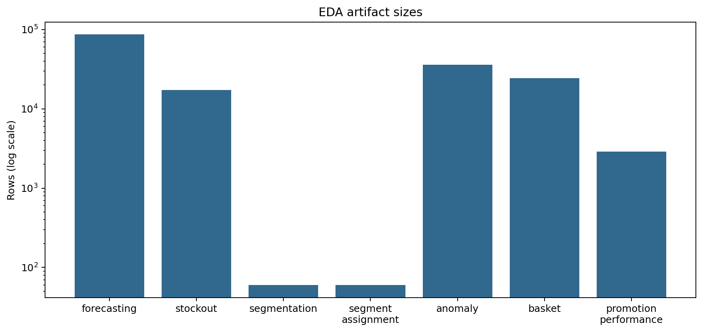

# General data understanding

All identifier columns are entity keys, not continuous measurements. Integer storage does not make `store_id`, `sku_id`, `warehouse_id`, `promotion_id`, `order_id`, or `region_id` quantitative.

| Artifact | Rows | Columns | Date range | Duplicate keys |
|---|---:|---:|---|---:|
| forecasting | 86,400 | 21 | 2024-01-01–2024-03-30 | 0 |
| stockout | 17,280 | 18 | 2024-01-01–2024-03-30 | 0 |
| segmentation | 60 | 13 | 2024-01-31–2024-03-30 | 0 |
| segment_assignment | 60 | 13 | 2024-01-31–2024-03-30 | 0 |
| anomaly | 35,892 | 12 | 2024-01-01–2024-03-30 | 0 |
| basket | 24,216 | 11 | 2024-01-01–2024-03-30 | 0 |
| promotion_performance | 2,880 | 16 | 2024-01-01–2024-03-01 | 0 |

## Feature taxonomy

- Numerical: prices, quantities, lags, rolling statistics, inventory, revenue and profit.
- Categorical: brand, category, store type, channel, promotion and discount type.
- Binary: scheduled promotion, stockout/event indicators, horizon completeness.
- Temporal: prediction, snapshot, event, order and promotion dates.
- Identifiers: store, SKU, warehouse, promotion, order and region IDs.

