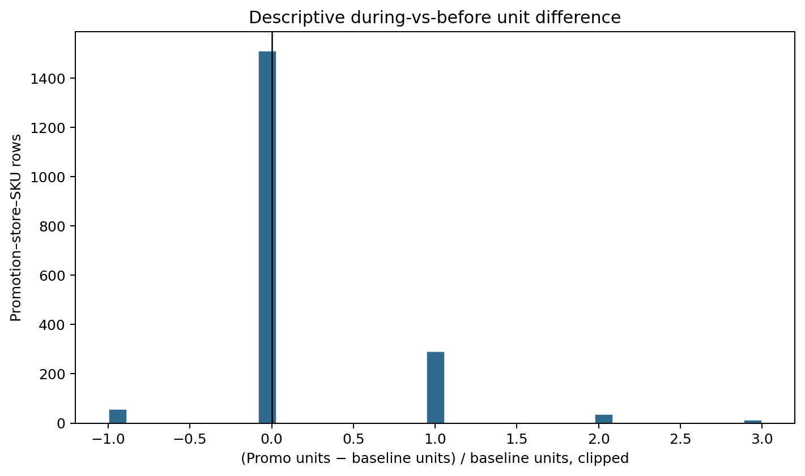
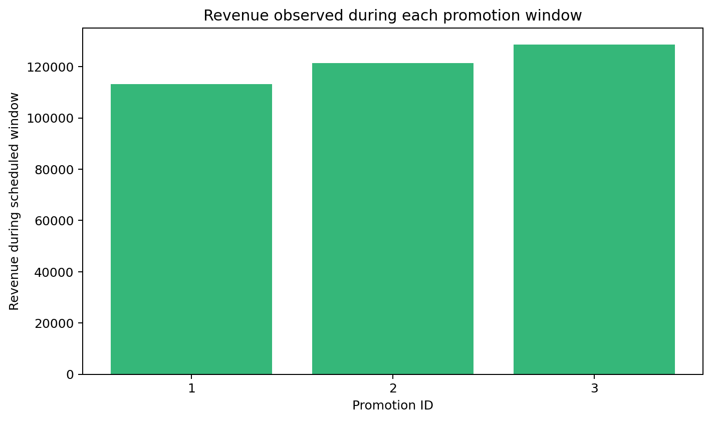

# Promotion performance EDA

- Rows without baseline history: 960 (33.33%)
- Rows without post-period history: 960 (33.33%)
- Rows with usable before/during comparison: 1,920

The first promotion lacks preceding history; the last lacks post-period history. Percentage measures exclude NULL or zero baselines rather than substituting zero.

All comparisons are descriptive: sales during a scheduled window versus preceding/following windows. The data has no untreated control group, randomized assignment, parallel-trend evidence, competitor activity or exogenous-demand controls, so causal promotion effects cannot be estimated.

## Readiness

**READY WITH LIMITATIONS** for descriptive analysis. **NOT READY** for causal effect estimation. A later causal design would require comparable untreated units, pre-trend history, treatment timing variation, confounder controls and preferably randomized or quasi-experimental assignment.

