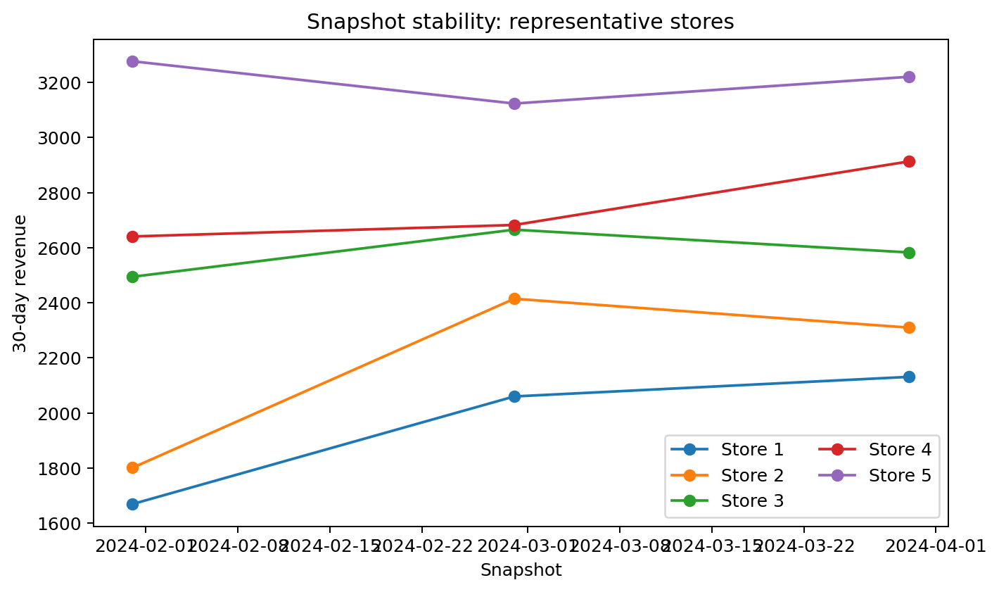

# Store segmentation EDA

The contract contains 60 snapshots but only 20 independent stores. Repeated snapshots improve temporal characterization; they do not create 60 independent entities.

All numerical features differ materially in scale, so distance-based clustering will require scaling. Revenue, units and profit are structurally correlated; feature redundancy should be checked before clustering. Floor area is static per store and may dominate Euclidean distance if left unscaled.

Store type, channel and region are categorical/entity attributes and must not be treated as ordinal integers. Encoding choices belong to modeling, not EDA.

## Readiness

**READY WITH LIMITATIONS.** Twenty stores can support an illustrative segmentation experiment but not a stable high-dimensional market taxonomy. Cluster stability must be assessed by store, not by randomly splitting the 60 snapshots. `segment_assignment` remains **NOT READY** until a clustering model creates assignments.

