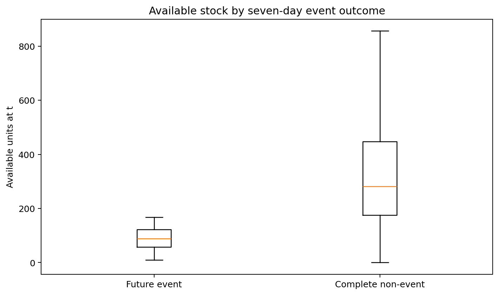

# Stockout EDA

## Target distribution

- Observed seven-day event rows: 14 (0.0810% of all rows)
- Complete non-event horizons: 15,922
- Incomplete horizons: 1,344
- Event rate among complete/evaluable horizons: 0.0879%
- Physical zero-stock episode starts: 2 across 2 warehouse–SKU series

The 14 positive labels are overlapping prediction horizons around a much smaller number of physical stockout episodes. They are not 14 independent events.

## Generator evidence

Inventory starts at 300–900 units. Replenishment adds three reorder-point quantities when stock is below reorder point and a deterministic five-day condition is satisfied. That combination strongly suppresses stockouts. The low event count is therefore mainly a synthetic-generation artifact, not evidence of a realistically calibrated rare-event process.

## Readiness

- **Stockout Classification: NOT READY.** Fourteen highly dependent positive rows cannot support stable supervised estimation or honest validation. Oversampling would replicate information, not create events.
- **Stockout Survival: NOT READY.** Censoring is represented correctly, but there are too few independent events to estimate a useful event-time relationship.

Recommendation for a later data-generation phase: calibrate initial stock, replenishment size/delay and demand pressure to generate more independent stockout episodes. Do not modify the generator inside EDA.

