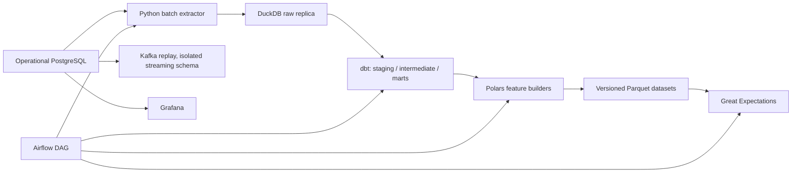

# Data platform architecture

DuckDB is the executed local analytical warehouse fallback. BigQuery is configured but not executed without credentials. Airbyte’s role is PostgreSQL-to-warehouse replication; the local extractor executes the same bounded batch responsibility where an Airbyte server is unavailable.
