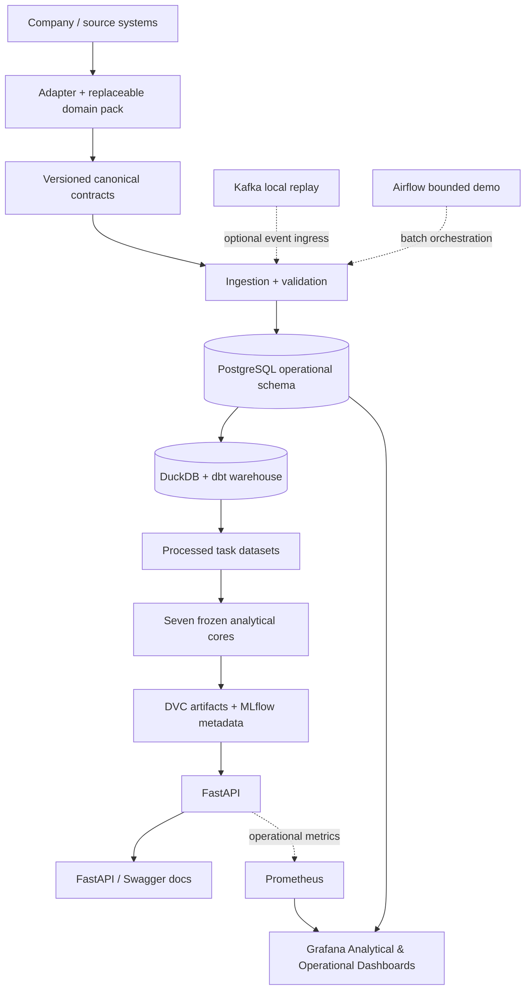

# Portfolio architecture V1.3

The solid path is the primary batch-to-product lineage. Kafka is an optional isolated replay simulation. Airflow demonstrates bounded orchestration and does not imply a persistent deployment. Prometheus and Grafana observe the API; they are not inference dependencies.

Company-specific mappings live under `config/domains`. Scientific implementations do not depend on the Coca-Cola demo pack. PostgreSQL remains operational; derived features, predictions and analytical outputs remain outside its schema.
