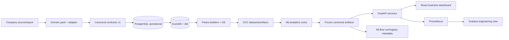

# System architecture V1

The generic package never imports `coca_cola_demo`. Domain packs depend on canonical contracts and are selected at the boundary. Kafka is optional replay simulation; Airflow is a DAG definition; Airbyte and BigQuery are templates. Batch inference is primary, HTTP inference is integration/demo access.

