# Operational PostgreSQL ERD

Generated from live PostgreSQL `fmcg.fmcg` metadata on `2026-09-16T14:25:15.599626+00:00`. PostgreSQL `17.11`.

Logical domains: **PRODUCT MASTER** — categories, brands, products, skus; **LOCATION / DISTRIBUTION** — regions, stores, warehouses; **PROMOTIONS** — promotions, promotion_skus, promotion_stores; **PRICING** — product_prices; **SALES** — sales, daily_demand; **ORDERS / DELIVERIES** — orders, order_items, deliveries, delivery_items; **INVENTORY** — inventory.

```mermaid
erDiagram
    BRANDS {
        bigint brand_id PK "not_null"
        text brand_name UK "not_null"
        text manufacturer "not_null"
        boolean partner_brand "not_null"
        boolean active "not_null"
        provenance_kind provenance "not_null"
    }
    CATEGORIES {
        bigint category_id PK "not_null"
        text category_name UK "not_null"
        bigint parent_category_id UK, FK "nullable"
        text description "nullable"
    }
    DAILY_DEMAND {
        bigint demand_observation_id PK "not_null"
        date observation_date UK "not_null"
        bigint store_id UK, FK "not_null"
        bigint sku_id UK, FK "not_null"
        bigint warehouse_id FK "not_null"
        integer requested_demand_units "not_null"
        integer realized_sales_units "not_null"
        integer lost_sales_units "not_null"
        boolean demand_censored_by_inventory "not_null"
        integer inventory_available_before "not_null"
        bigint promotion_id FK "nullable"
    }
    DELIVERIES {
        bigint delivery_id PK "not_null"
        text delivery_code UK "not_null"
        bigint order_id FK "nullable"
        bigint warehouse_id FK "not_null"
        bigint store_id FK "not_null"
        timestamp_without_time_zone shipped_at "nullable"
        timestamp_without_time_zone delivered_at "nullable"
        delivery_status status "not_null"
    }
    DELIVERY_ITEMS {
        bigint delivery_id PK, FK "not_null"
        bigint sku_id PK, FK "not_null"
        integer quantity "not_null"
    }
    INVENTORY {
        bigint inventory_id PK "not_null"
        date snapshot_date UK "not_null"
        bigint warehouse_id UK, FK "not_null"
        bigint sku_id UK, FK "not_null"
        integer opening_stock_quantity "not_null"
        integer stock_quantity "not_null"
        integer reserved_quantity "not_null"
        integer available_quantity "nullable"
        integer reorder_point "not_null"
        integer safety_stock "not_null"
        integer replenishment_quantity "not_null"
        integer replenishment_ordered_quantity "not_null"
        integer replenishment_lead_time_days "nullable"
        date expected_replenishment_date "nullable"
        integer demand_requested "not_null"
        integer demand_fulfilled "not_null"
        integer lost_sales_quantity "not_null"
        integer adjustment_quantity "not_null"
    }
    ORDER_ITEMS {
        bigint order_item_id PK "not_null"
        bigint order_id UK, FK "not_null"
        bigint sku_id UK, FK "not_null"
        integer quantity "not_null"
        numeric_12_2 unit_price "not_null"
        numeric_12_2 discount_amount "not_null"
        numeric_14_2 line_total "nullable"
    }
    ORDERS {
        bigint order_id PK "not_null"
        text order_code UK "not_null"
        bigint store_id FK "not_null"
        date order_date "not_null"
        date requested_delivery_date "not_null"
        date actual_delivery_date "nullable"
        order_status status "not_null"
        numeric_14_2 subtotal "not_null"
        numeric_14_2 discount_amount "not_null"
        numeric_14_2 total_amount "not_null"
        provenance_kind provenance "not_null"
        text external_source "nullable"
        text external_id "nullable"
    }
    PRODUCT_PRICES {
        bigint price_id PK "not_null"
        bigint store_id UK, FK "not_null"
        bigint sku_id UK, FK "not_null"
        date valid_from UK "not_null"
        date valid_to "not_null"
        numeric_12_2 regular_price "not_null"
        numeric_12_2 selling_price "not_null"
        provenance_kind provenance "not_null"
    }
    PRODUCTS {
        bigint product_id PK "not_null"
        bigint category_id FK "not_null"
        bigint brand_id UK, FK "not_null"
        text product_name UK "not_null"
        text description "nullable"
        boolean sugar_free "not_null"
        boolean active "not_null"
        provenance_kind provenance "not_null"
    }
    PROMOTION_SKUS {
        bigint promotion_id PK, FK "not_null"
        bigint sku_id PK, FK "not_null"
    }
    PROMOTION_STORES {
        bigint promotion_id PK, FK "not_null"
        bigint store_id PK, FK "not_null"
    }
    PROMOTIONS {
        bigint promotion_id PK "not_null"
        text promotion_name "not_null"
        text promotion_type "not_null"
        date start_date "not_null"
        date end_date "not_null"
        text discount_type "not_null"
        numeric_12_2 discount_value "not_null"
        text description "nullable"
        provenance_kind provenance "not_null"
    }
    REGIONS {
        bigint region_id PK "not_null"
        text region_name UK "not_null"
        text country UK "not_null"
    }
    SALES {
        bigint sale_id PK "not_null"
        date sale_date UK "not_null"
        bigint store_id UK, FK "not_null"
        bigint sku_id UK, FK "not_null"
        integer quantity_units "not_null"
        numeric_12_2 unit_price "not_null"
        numeric_14_2 gross_revenue "not_null"
        numeric_14_2 discount_amount "not_null"
        numeric_14_2 net_revenue "not_null"
        numeric_12_2 unit_cost "not_null"
        numeric_14_2 gross_profit "not_null"
        bigint promotion_id FK "nullable"
        provenance_kind provenance "not_null"
        text external_source "nullable"
        text external_id "nullable"
    }
    SKUS {
        bigint sku_id PK "not_null"
        bigint product_id UK, FK "not_null"
        text sku_code UK "not_null"
        text flavor UK "nullable"
        text package_type UK "not_null"
        integer volume_ml UK "not_null"
        integer units_per_case "not_null"
        numeric_12_2 base_price "not_null"
        numeric_12_2 standard_cost "not_null"
        boolean active "not_null"
        provenance_kind provenance "not_null"
    }
    STORES {
        bigint store_id PK "not_null"
        text external_store_code UK "nullable"
        text store_name "not_null"
        bigint region_id FK "not_null"
        text city "not_null"
        text store_type "not_null"
        text channel "not_null"
        numeric_12_2 floor_area_m2 "nullable"
        boolean active "not_null"
        date opened_at "not_null"
        provenance_kind provenance "not_null"
    }
    WAREHOUSES {
        bigint warehouse_id PK "not_null"
        text warehouse_code UK "not_null"
        text warehouse_name "not_null"
        bigint region_id FK "not_null"
        text city "not_null"
        integer capacity_units "nullable"
        boolean active "not_null"
    }
    CATEGORIES ||--o{ CATEGORIES : "parent_category_id → category_id"
    PROMOTIONS ||--o{ DAILY_DEMAND : "promotion_id → promotion_id"
    SKUS ||--|{ DAILY_DEMAND : "sku_id → sku_id"
    STORES ||--|{ DAILY_DEMAND : "store_id → store_id"
    WAREHOUSES ||--|{ DAILY_DEMAND : "warehouse_id → warehouse_id"
    ORDERS ||--o{ DELIVERIES : "order_id → order_id"
    STORES ||--|{ DELIVERIES : "store_id → store_id"
    WAREHOUSES ||--|{ DELIVERIES : "warehouse_id → warehouse_id"
    DELIVERIES ||--|{ DELIVERY_ITEMS : "delivery_id → delivery_id"
    SKUS ||--|{ DELIVERY_ITEMS : "sku_id → sku_id"
    SKUS ||--|{ INVENTORY : "sku_id → sku_id"
    WAREHOUSES ||--|{ INVENTORY : "warehouse_id → warehouse_id"
    ORDERS ||--|{ ORDER_ITEMS : "order_id → order_id"
    SKUS ||--|{ ORDER_ITEMS : "sku_id → sku_id"
    STORES ||--|{ ORDERS : "store_id → store_id"
    SKUS ||--|{ PRODUCT_PRICES : "sku_id → sku_id"
    STORES ||--|{ PRODUCT_PRICES : "store_id → store_id"
    BRANDS ||--|{ PRODUCTS : "brand_id → brand_id"
    CATEGORIES ||--|{ PRODUCTS : "category_id → category_id"
    PROMOTIONS ||--|{ PROMOTION_SKUS : "promotion_id → promotion_id"
    SKUS ||--|{ PROMOTION_SKUS : "sku_id → sku_id"
    PROMOTIONS ||--|{ PROMOTION_STORES : "promotion_id → promotion_id"
    STORES ||--|{ PROMOTION_STORES : "store_id → store_id"
    PROMOTIONS ||--o{ SALES : "promotion_id → promotion_id"
    SKUS ||--|{ SALES : "sku_id → sku_id"
    STORES ||--|{ SALES : "store_id → store_id"
    PRODUCTS ||--|{ SKUS : "product_id → product_id"
    REGIONS ||--|{ STORES : "region_id → region_id"
    REGIONS ||--|{ WAREHOUSES : "region_id → region_id"
```

Legend: **PK** = Primary Key; **FK** = Foreign Key; **UK** = Unique/business key. On multi-column constraints, UK marks participation in the composite key. `not_null` and `nullable` reflect live column metadata.

## Implemented primary and unique keys

| Table | Kind | PostgreSQL definition |
|---|---|---|
| `brands` | PK | `PRIMARY KEY (brand_id)` |
| `brands` | UK | `UNIQUE (brand_name)` |
| `categories` | PK | `PRIMARY KEY (category_id)` |
| `categories` | UK | `UNIQUE (category_name, parent_category_id)` |
| `daily_demand` | PK | `PRIMARY KEY (demand_observation_id)` |
| `daily_demand` | UK | `UNIQUE (observation_date, store_id, sku_id)` |
| `deliveries` | PK | `PRIMARY KEY (delivery_id)` |
| `deliveries` | UK | `UNIQUE (delivery_code)` |
| `delivery_items` | PK | `PRIMARY KEY (delivery_id, sku_id)` |
| `inventory` | PK | `PRIMARY KEY (inventory_id)` |
| `inventory` | UK | `UNIQUE (snapshot_date, warehouse_id, sku_id)` |
| `order_items` | PK | `PRIMARY KEY (order_item_id)` |
| `order_items` | UK | `UNIQUE (order_id, sku_id)` |
| `orders` | PK | `PRIMARY KEY (order_id)` |
| `orders` | UK | `UNIQUE (order_code)` |
| `product_prices` | PK | `PRIMARY KEY (price_id)` |
| `product_prices` | UK | `UNIQUE (store_id, sku_id, valid_from)` |
| `products` | PK | `PRIMARY KEY (product_id)` |
| `products` | UK | `UNIQUE (brand_id, product_name)` |
| `promotion_skus` | PK | `PRIMARY KEY (promotion_id, sku_id)` |
| `promotion_stores` | PK | `PRIMARY KEY (promotion_id, store_id)` |
| `promotions` | PK | `PRIMARY KEY (promotion_id)` |
| `regions` | PK | `PRIMARY KEY (region_id)` |
| `regions` | UK | `UNIQUE (country, region_name)` |
| `sales` | PK | `PRIMARY KEY (sale_id)` |
| `sales` | UK | `UNIQUE (sale_date, store_id, sku_id)` |
| `skus` | PK | `PRIMARY KEY (sku_id)` |
| `skus` | UK | `UNIQUE (product_id, package_type, volume_ml, flavor)` |
| `skus` | UK | `UNIQUE (sku_code)` |
| `stores` | PK | `PRIMARY KEY (store_id)` |
| `stores` | UK | `UNIQUE (external_store_code)` |
| `warehouses` | PK | `PRIMARY KEY (warehouse_id)` |
| `warehouses` | UK | `UNIQUE (warehouse_code)` |

Verified coverage: **18 tables**, **29 foreign-key relationships**. Each relationship above corresponds to exactly one live PostgreSQL FK constraint; no additional conceptual relationships are included.
