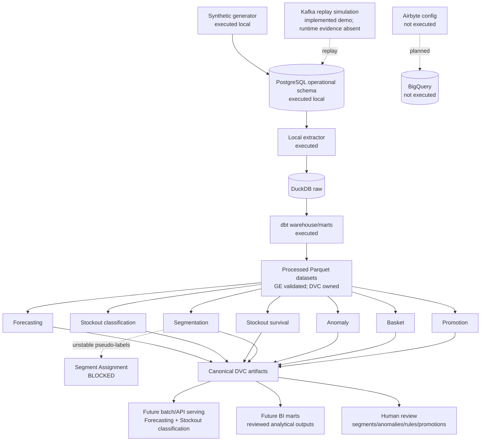

# Data and Model Dependency Map

There are no model-to-model runtime dependencies among implemented cores. Stockout models use their own historical velocity and inventory features, not Forecasting predictions. Anomaly V1 cannot consume Forecasting V1 residuals because Forecasting predicts a seven-day aggregate and Anomaly operates on observed event-day rows. Segment Assignment is the only explicitly blocked downstream dependency.

Semantic glossary:

- `realized_sales_units`: observed fulfilled sales.
- `requested_demand_units`: synthetic latent/requested demand context, not interchangeable with sales.
- `target_units_next_7d`: future realized units in `(t,t+7]`.
- `stockout_within_7d`: occurrence of the first future stockout within `(t,t+7]`.
- survival event: first future physical stockout onset for an at-risk row.
- anomaly candidate: unsupervised review candidate, not confirmed fraud/error.
- segment pseudo-label: exploratory cluster membership, not a validated supervised target.
- association rule: co-occurrence statistic, not recommendation or causation.
- promotion descriptive change: eligible matched-window observed difference, not causal uplift.
